# Architecture Documentation

This document provides detailed architecture diagrams using Mermaid for the Passkey Demo application.

## Table of Contents
1. [System Architecture](#system-architecture)
2. [Registration Flow](#registration-flow)
3. [Authentication Flow](#authentication-flow)
4. [Component Interaction](#component-interaction)
5. [Deployment Architecture](#deployment-architecture)

---

## System Architecture

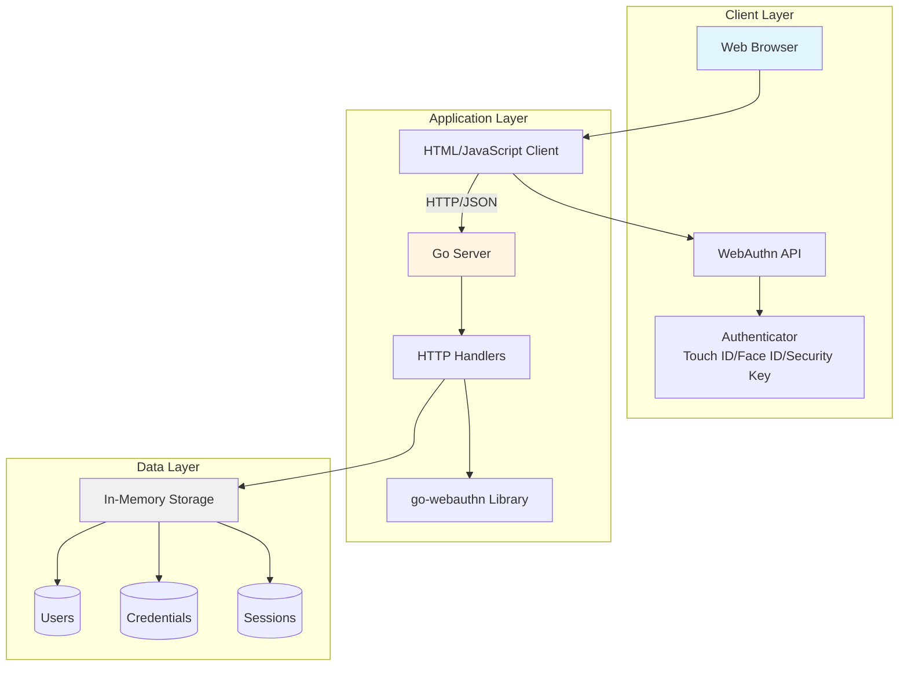

---

## Registration Flow

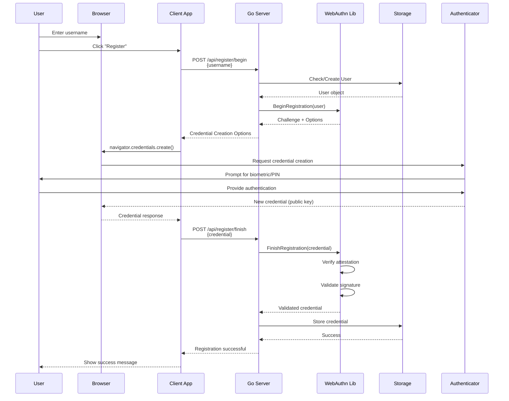

---

## Authentication Flow

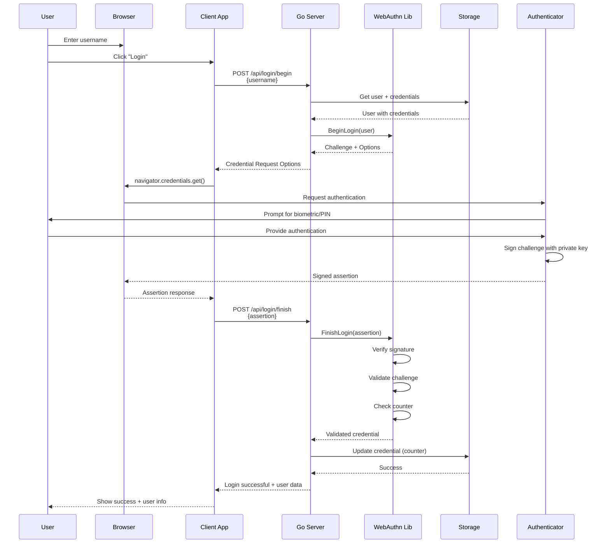

---

## Component Interaction

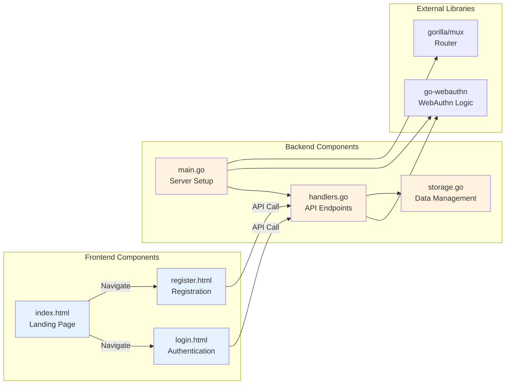

---

## API Endpoint Flow

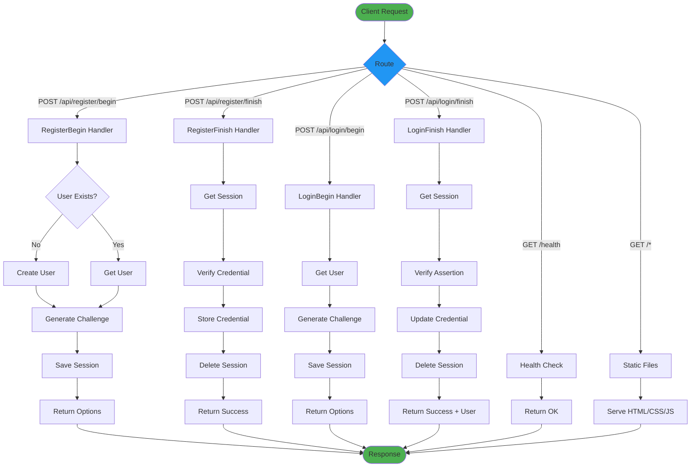

---

## Deployment Architecture

### Docker Deployment

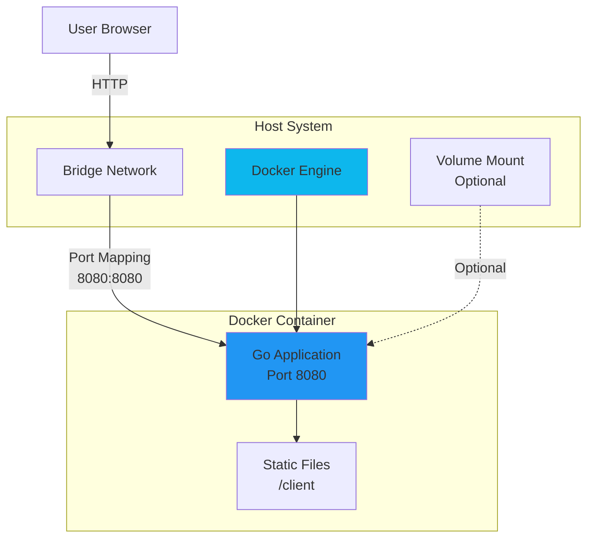

### Kubernetes Deployment

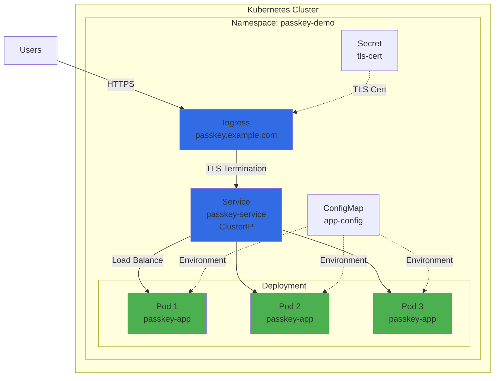

---

## Data Model

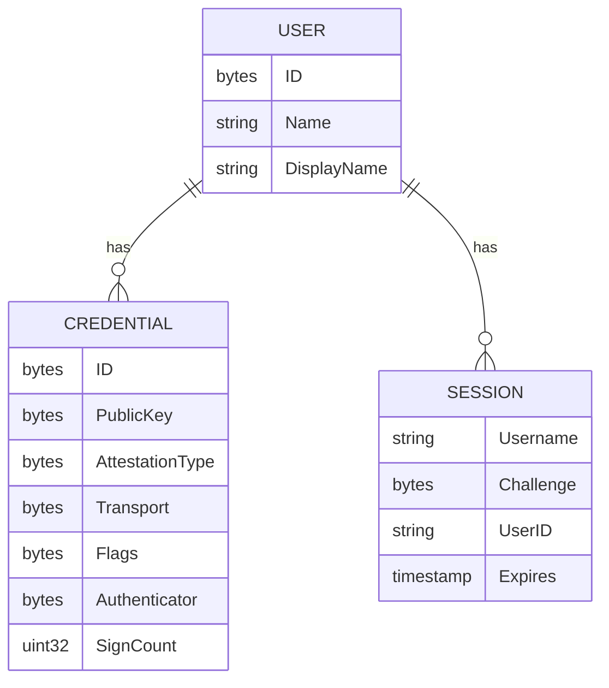

---

## Security Flow

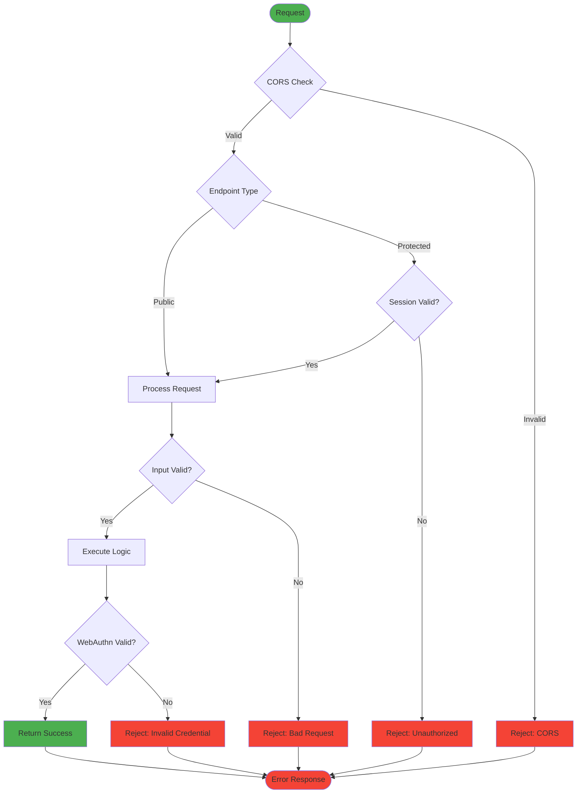

---

## Technology Stack

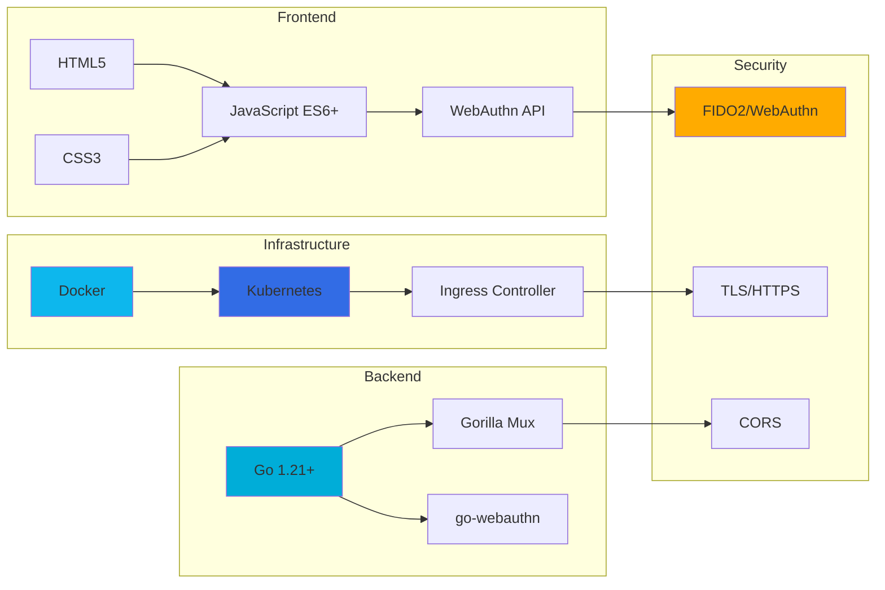

---

## Scalability Architecture

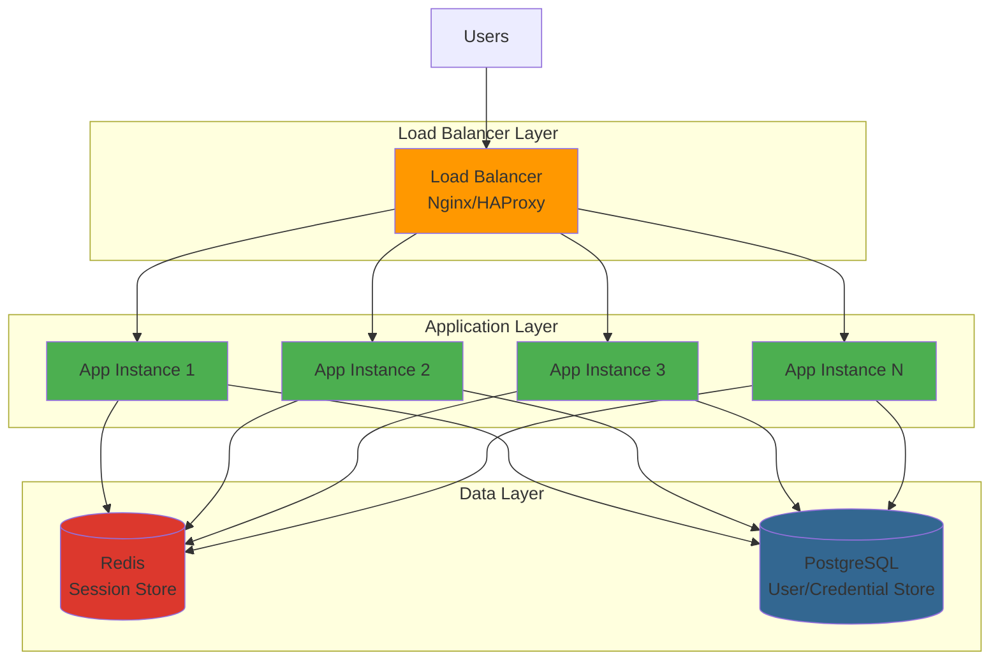

---

## Notes

- All diagrams are rendered using Mermaid syntax
- View these diagrams in any Markdown viewer that supports Mermaid
- GitHub, GitLab, and most modern documentation tools support Mermaid
- For best viewing experience, use a Mermaid-compatible viewer or IDE extension